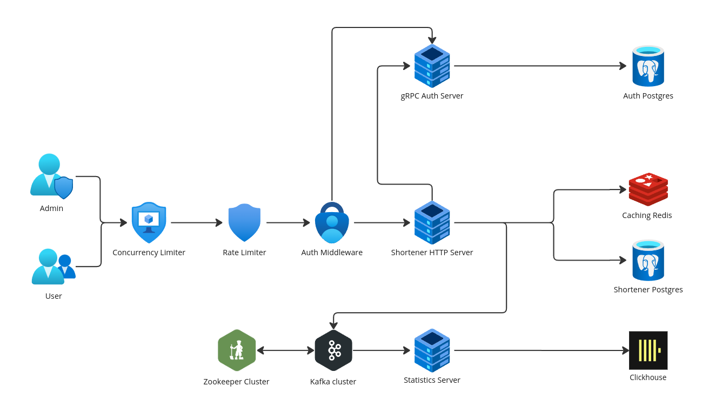

# 💨 min
_(**M**in **I**s **N**otlengthy)_

---
### Description

**_min_** is a minimalistic and efficient URL shortener written in _**Go**_. 

It provides simple **_http_** endpoints to shorten URLs and stores statistics about redirects. It is designed to have billing plans and user authentication system.

The following architecture is used:


The application consists of three main parts:
1. **_Shortener_** - responsible for shortening URLs and redirecting clients. It is http server that listens on port `:8080` and provides the following endpoints available for users:
   - POST `/login` - logs in a user and returns a JWT token.
   - POST `/register` - registers a new user. Requires JWT token and is available only for admin users.
   - POST `/shorten?url=<too_long_url>` - adds `too_long_url` to the database and returns a shortened version of it. Requires JWT token.
   - GET `/<shortened_url>` - redirects to the original URL.
   
**_Shortener_** communicates with **_Auth_** server to authenticate users and uses _PostgreSQL_ as permanent storage and _Redis_ as cache. It also sends information about redirects to Kafka cluster.

2. **_Auth_** - responsible for user authentication. It is gRPC server that listens on port `:50051` and provides endpoints for user authentication.

3. **_Statistics_** - responsible for storing and displaying statistics. This service is listening for redirects information from Kafka and stores it in _Clickhouse_.

Project also provides some basic limiters to prevent abuse of the service.

---
### Usage

`make all` runs the entire application via `docker-compose`.

Default admin credentials are:
```
Username: admin
Password: password
```
**PS.** Here are some examples of requests for convenience:

1. Getting JWT token
```
curl --location 'http://localhost:8080/login' \
--header 'Content-Type: application/json' \
--data '{
    "username": "admin",
    "password": "password"
}'
```

2. Adding link to the database
```
curl --location --request POST 'http://localhost:8080/shorten?url=https%3A%2F%2Fgoogle.com' \
--header 'Authorization: Bearer <some_token>'
```

---
